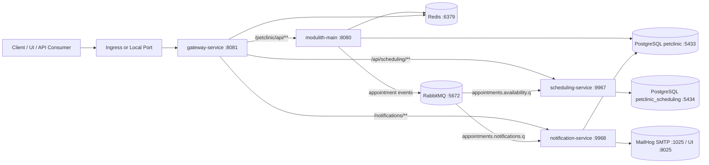

# Spring PetClinic REST Backend
[](https://github.com/spring-petclinic/spring-petclinic-rest/actions/workflows/maven-build-master.yml)
[](https://github.com/spring-petclinic/spring-petclinic-rest/actions/workflows/docker-build.yml)
[](https://sonarcloud.io/dashboard?id=spring-petclinic_spring-petclinic-rest)
[](https://sonarcloud.io/dashboard?id=spring-petclinic_spring-petclinic-rest)

[](https://adoptium.net/)
[](https://spring.io/projects/spring-boot)
[](https://spring.io/projects/spring-cloud-gateway)
[](https://spring.io/projects/spring-modulith)
[](https://www.postgresql.org/)
[](https://www.rabbitmq.com/)
[](https://redis.io/)
[](https://www.docker.com/)
[](https://kubernetes.io/)
[](LICENSE.txt)

Backend-only, API-first PetClinic implementation with:

- A modular monolith (`modulith-main`) for core business APIs.
- Supporting microservices (`gateway-service`, `scheduling-service`, `notification-service`).
- Event-driven integration through RabbitMQ.
- Deployment-ready manifests for Docker Compose and Kubernetes.

The Angular frontend is not part of this repository.

## Table of Contents

- [1. System Overview](#1-system-overview)
- [2. Architecture](#2-architecture)
- [3. Repository Layout](#3-repository-layout)
- [4. Local Deployment](#4-local-deployment)
- [5. Kubernetes Deployment](#5-kubernetes-deployment)
- [6. Configuration Reference](#6-configuration-reference)
- [7. Security and Authentication](#7-security-and-authentication)
- [8. Observability](#8-observability)
- [9. Testing](#9-testing)
- [10. CI/CD](#10-cicd)
- [11. Operational Notes](#11-operational-notes)
- [12. License](#12-license)

## 1. System Overview

This codebase is organized as a multi-module Maven build under `petclinic-services`:

- `modulith-main`: Core PetClinic domain APIs (owners, pets, vets, visits, appointments, IAM, auth).
- `gateway-service`: Spring Cloud Gateway edge service with JWT validation and Redis-backed rate limiting.
- `scheduling-service`: Availability/capacity service and async consumer for appointment events.
- `notification-service`: Email notification service and async consumer for appointment events.
- `common`: Shared contracts/events/configuration across modules.

## 2. Architecture

### 2.1 Runtime Topology



### 2.2 Core Service Responsibilities

| Service | Port | Primary Role | Data/Infra Dependencies |
|---|---:|---|---|
| `gateway-service` | 8081 | API entrypoint, JWT resource server, route forwarding, rate limiting | Redis |
| `modulith-main` | 8080 | Core PetClinic business APIs, auth, OpenAPI/Swagger, event publication | PostgreSQL (`petclinic`), Redis, RabbitMQ |
| `scheduling-service` | 9967 | Vet capacity/slot API, appointment availability consumer | PostgreSQL (`petclinic_scheduling`), RabbitMQ |
| `notification-service` | 9968 | Appointment notification consumer, SMTP email dispatch | PostgreSQL (`petclinic`), RabbitMQ, SMTP (MailHog in dev) |

### 2.3 Modulith Internal Structure

`modulith-main` follows a modular package architecture with clear boundaries:

- `appointments`: `api`, `app`, `domain`, `infra`, `messaging`, `web`
- `authentication`: `api`, `config`, `domain`, `internal`, `util`, `web`
- `catalog`: `api`, `app`, `domain`, `infra`, `mapper`, `web`
- `iam`: `api`, `app`, `domain`, `infra`, `mapper`, `web`
- `owners`: `api`, `app`, `domain`, `infra`, `mapper`, `web`
- `vets`: `api`, `app`, `domain`, `infra`, `mapper`, `web`
- `visits`: `api`, `app`, `domain`, `infra`, `mapper`, `web`
- `platform`: cross-cutting concerns (security toggle, CORS props, root endpoints)

### 2.4 Messaging Topology

Appointment messaging defaults (from `AppointmentMessagingProperties`):

- Exchange: `petclinic.appointments.exchange`
- Routing keys:
  - `appointments.confirmed`
  - `appointments.visit-linked`
- Queues:
  - `appointments.notifications.q` (+ DLQ `appointments.notifications.dlq`)
  - `appointments.availability.q` (+ DLQ `appointments.availability.dlq`)
- DLX: `petclinic.appointments.dlx`

`modulith-main` publishes events via AMQP with Retry + Circuit Breaker.  
Consumers in `scheduling-service` and `notification-service` process events with DLQ handling.

## 3. Repository Layout

```text
.
├─ docker-compose.yml
├─ k8s/
│  ├─ infra/                     # rabbitmq, redis, mailhog
│  └─ prod/                      # app deployments/services/ingress/config
├─ petclinic-services/
│  ├─ pom.xml                    # parent Maven build
│  ├─ common/
│  ├─ modulith-main/
│  ├─ gateway-service/
│  ├─ scheduling-service/
│  └─ notification-service/
├─ postman-tests.sh
├─ prometheus.yml
└─ results/                      # benchmark and report artifacts
```

## 4. Local Deployment

### 4.1 Prerequisites

- Java 17+
- Maven 3.9+ (or Maven Wrapper `mvnw`)
- Docker + Docker Compose
- Optional for API regression tests: Node.js + `jq`

### 4.2 Start Infrastructure Services

From repository root:

```bash
docker compose up -d postgres-main postgres-scheduling redis rabbitmq mailhog prometheus grafana
```

Optional MySQL profile (not required for default setup):

```bash
docker compose --profile mysql up -d mysql
```

### 4.3 Build All Services

```bash
cd petclinic-services
./mvnw clean package
```

### 4.4 Run Services (4 terminals)

Terminal 1:

```bash
cd petclinic-services
./mvnw -pl modulith-main -am spring-boot:run
```

Terminal 2:

```bash
cd petclinic-services
./mvnw -pl scheduling-service -am spring-boot:run
```

Terminal 3:

```bash
cd petclinic-services
./mvnw -pl notification-service -am spring-boot:run
```

Terminal 4:

```bash
cd petclinic-services
./mvnw -pl gateway-service -am spring-boot:run
```

### 4.5 Verify Runtime Endpoints

| Component | URL |
|---|---|
| Gateway health | `http://localhost:8081/actuator/health` |
| Modulith health | `http://localhost:8080/petclinic/actuator/health` |
| Scheduling health (through gateway) | `http://localhost:8081/actuator/scheduling/health` |
| Notification health (through gateway) | `http://localhost:8081/actuator/notifications/health` |
| Swagger UI (modulith direct) | `http://localhost:8080/petclinic/swagger-ui.html` |
| OpenAPI docs (modulith direct) | `http://localhost:8080/petclinic/v3/api-docs` |

## 5. Kubernetes Deployment

The repository includes two manifest groups:

- `k8s/infra`: Redis, RabbitMQ, MailHog in namespace `infra`
- `k8s/prod`: app deployments/services/ingress/config in namespace `prod`

### 5.1 Prerequisites

- Kubernetes cluster (K3s-compatible)
- `kubectl` configured against target cluster
- Ingress controller compatible with `ingressClassName: traefik`

### 5.2 Create Namespaces

```bash
kubectl create namespace infra --dry-run=client -o yaml | kubectl apply -f -
kubectl create namespace prod --dry-run=client -o yaml | kubectl apply -f -
```

### 5.3 Review Configuration and Secrets

Before deploying to any shared/production environment:

1. Replace credentials and connection strings in `k8s/prod/prod-config.yaml`.
2. Prefer external secret management (External Secrets, Vault, cloud secret manager).
3. Avoid committing real credentials in plaintext manifests.

### 5.4 Apply Manifests

```bash
kubectl apply -f k8s/infra/
kubectl apply -f k8s/prod/
```

### 5.5 Validate

```bash
kubectl get pods -n infra
kubectl get pods -n prod
kubectl get svc -n prod
kubectl get ingress -n prod
```

Traffic flow in cluster:

- Ingress routes all paths to `gateway-service:8081`.
- Gateway forwards to internal services:
  - `/petclinic/api/**` -> `modulith-main:8080`
  - `/api/scheduling/**` -> `scheduling-service:9967`
  - `/notifications/**` -> `notification-service:9968`

## 6. Configuration Reference

### 6.1 Main Runtime Variables

| Variable | Used By | Purpose |
|---|---|---|
| `SERVER_PORT` | all services | Override service port |
| `DB_URL`, `DB_HOST`, `DB_PORT`, `DB_USERNAME`, `DB_PASSWORD` | `modulith-main`, `scheduling-service` | Primary datasource configuration |
| `SCHEDULING_DB_URL`, `SCHEDULING_DB_USERNAME`, `SCHEDULING_DB_PASSWORD` | `scheduling-service` | Scheduling database profile properties |
| `SPRING_DATASOURCE_URL`, `SPRING_DATASOURCE_USERNAME`, `SPRING_DATASOURCE_PASSWORD` | all DB-backed services | Standard Spring datasource override |
| `REDIS_HOST`, `REDIS_PORT`, `REDIS_PASSWORD` | `modulith-main`, `gateway-service` | Redis connection |
| `RABBITMQ_HOST`, `RABBITMQ_PORT`, `RABBITMQ_USERNAME`, `RABBITMQ_PASSWORD` | `modulith-main`, `scheduling-service`, `notification-service` | AMQP connection |
| `MAIL_HOST`, `MAIL_PORT`, `MAIL_USERNAME`, `MAIL_PASSWORD` | `notification-service` | SMTP transport |
| `PETCLINIC_JWT_BASE64_SECRET` | `modulith-main`, `gateway-service` | JWT HMAC secret |

### 6.2 Gateway Routing Variables

- `BACKEND_URI` (default `http://localhost:8080`)
- `SCHEDULING_URI` (default `http://localhost:9967`)
- `NOTIFICATION_URI` (default `http://localhost:9968`)

### 6.3 Profiles

- `modulith-main` default profile stack: `postgres,spring-data-jpa`
- `scheduling-service` auto-adds profile: `scheduling-service`
- `notification-service` auto-adds profile: `notifications-service`

## 7. Security and Authentication

- JWT security is enabled by default in `modulith-main` (`petclinic.security.enable=true`).
- Authentication endpoint: `POST /petclinic/api/auth/login`
- Registration endpoint: `POST /petclinic/api/auth/register`
- Gateway validates JWT for non-public routes.

Default seeded users:

| Username | Password | Roles |
|---|---|---|
| `admin` | `admin` | `ADMIN`, `OWNER_ADMIN`, `VET_ADMIN` |
| `owner` | `owner` | `OWNER` |
| `vet` | `vet` | `VET` |

Example login:

```bash
curl -X POST http://localhost:8081/petclinic/api/auth/login \
  -H "Content-Type: application/json" \
  -d '{"username":"admin","password":"admin"}'
```

## 8. Observability

- Actuator endpoints enabled (`health`, `info`; Prometheus also enabled in legacy properties).
- Prometheus config is provided at root `prometheus.yml`.
- Docker Compose includes:
  - Prometheus (`:9090`)
  - Grafana (`:3000`)
  - MailHog UI (`:8025`)

## 9. Testing

### 9.1 Maven Unit/Integration Tests

```bash
cd petclinic-services
./mvnw test
```

### 9.2 Postman/Newman Regression Suite

```bash
bash postman-tests.sh
```

Artifacts: `petclinic-services/modulith-main/src/test/postman/reports/`

### 9.3 JMeter Performance Tests

```bash
jmeter -n \
  -t petclinic-services/modulith-main/src/test/jmeter/petclinic-jmeter-crud-benchmark.jmx \
  -l results/petclinic-test-results.jtl
```

## 10. CI/CD

GitHub Actions workflows in `.github/workflows`:

- `maven-build-master.yml`: Maven verify + Sonar scan on `master`.
- `maven-build-pull-request.yml`: PR build verification.
- `docker-build.yml`: Docker Hub build/publish flow.
- `deploy.yml`: branch `microservices` pipeline (test -> build/push images -> deploy manifests).
- `newman-pipeline.yml`: smoke/regression API tests via Newman.

## 11. Operational Notes

1. `modulith-main` serves APIs under context path `/petclinic`, while gateway exposes root `/`.
2. Swagger UI is reachable directly on `modulith-main`; gateway routes API and actuator paths only.
3. Bucket4j rate limits are configured in `gateway-service` and backed by Redis.
4. For production, rotate all secrets and remove plaintext credentials from manifests and kubeconfig files.

## 12. License

This project is licensed under Apache 2.0. See `LICENSE.txt`.
